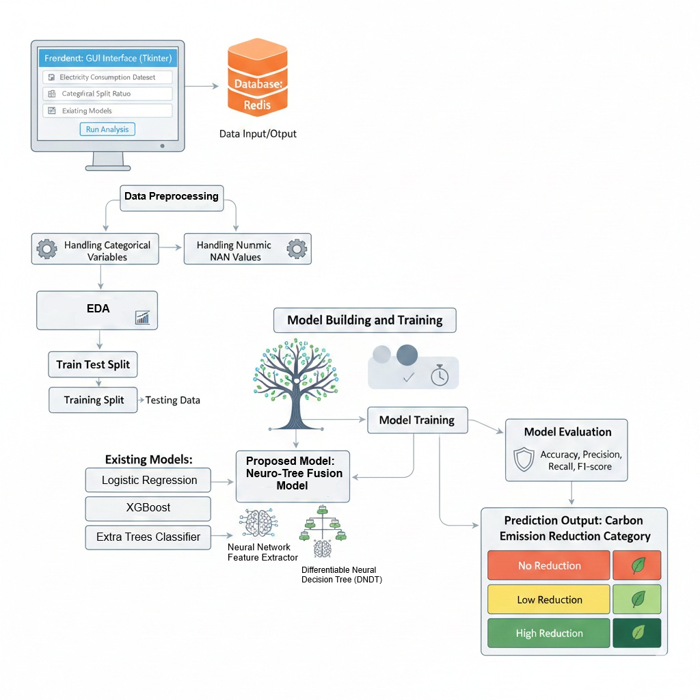
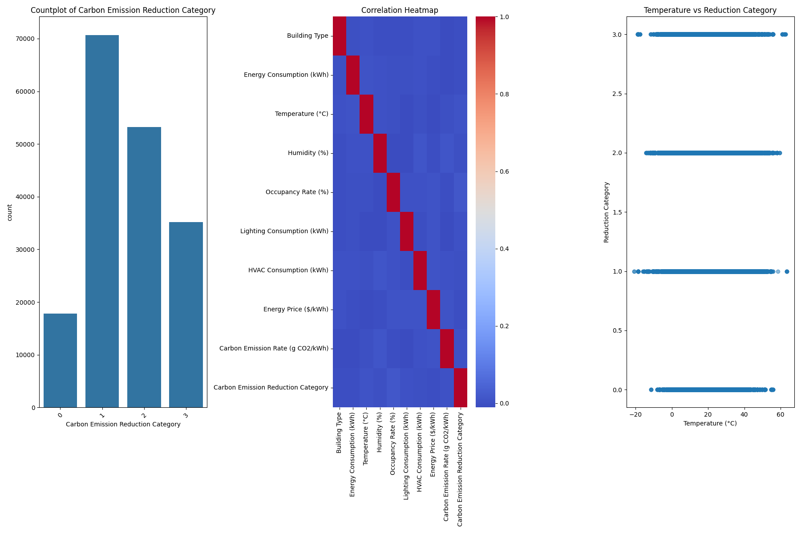
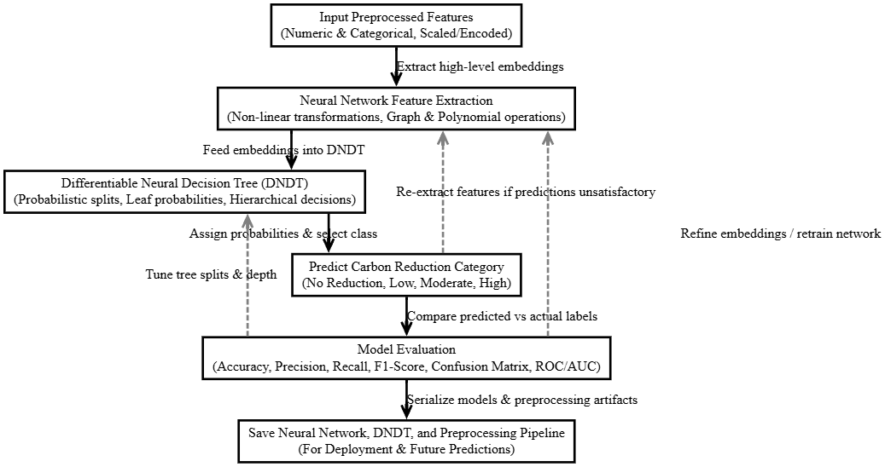
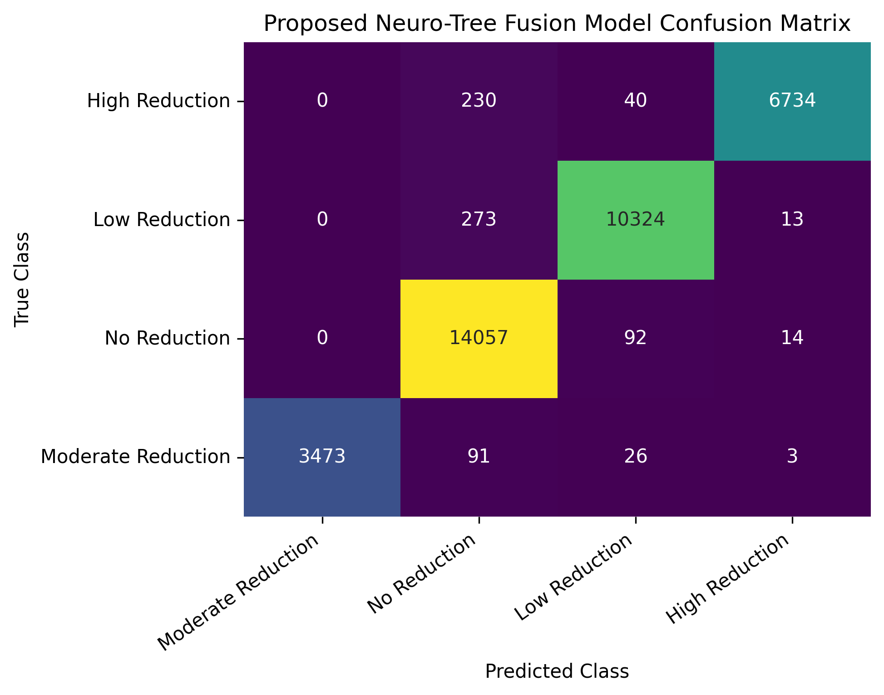
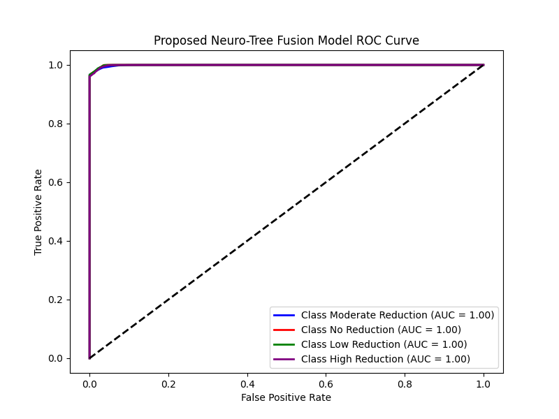

# GreenGrid AI

## AI-Based Carbon Emission Reduction Prediction

GreenGrid AI is an AI/ML-based building energy analytics system designed to analyze energy, environmental, and building-related parameters and predict carbon-emission reduction levels.

The system classifies buildings into four categories:

- No Reduction
- Low Reduction
- Moderate Reduction
- High Reduction

## Project Objectives

- Analyze building energy consumption and environmental parameters.
- Identify patterns associated with carbon emissions.
- Predict carbon-emission reduction categories.
- Compare multiple machine-learning classification models.
- Develop a proposed Neuro-Tree Fusion approach.

## Machine Learning Models

The project implements and compares:

- Logistic Regression
- XGBoost
- Extra Trees Classifier
- Proposed Neuro-Tree Fusion Model

## Methodology

The project includes:

1. Data preprocessing
2. Exploratory Data Analysis
3. Feature processing
4. Model training
5. Model evaluation
6. Carbon-emission reduction prediction

## Model Evaluation

Models were evaluated using:

- Accuracy
- Precision
- Recall
- F1-Score
- Confusion Matrix
- ROC-AUC

## Technologies Used

- Python
- Pandas
- NumPy
- Scikit-learn
- XGBoost
- TensorFlow/Keras
- Matplotlib
- Seaborn
- Tkinter
- Redis

## Project Architecture



## Exploratory Data Analysis



## Proposed Model



## Results

The repository contains model evaluation results including confusion matrices and ROC curves for the implemented machine-learning models.

### Proposed Neuro-Tree Fusion Model — Confusion Matrix



### Proposed Neuro-Tree Fusion Model — ROC Curve



## Project Structure

```text
GreenGrid-AI/
├── src/
│   ├── Main.py
│   ├── DNDT_Classifier.py
│   └── Graph_Polynomial_Neural_Network.py
├── architectures/
├── results/
├── background.jpg
├── README.md
├── requirements.txt
└── .gitignore
```

## How to Run

### 1. Clone the Repository

```bash
git clone https://github.com/sohailthanveersk/GreenGrid-AI.git
cd GreenGrid-AI
```

### 2. Install Dependencies

Install the required Python libraries:

```bash
pip install -r requirements.txt
```

### 3. Start Redis

GreenGrid AI uses Redis for user authentication and role management. Make sure a Redis server is running locally on:

```text
localhost:6379
```

### 4. Run the Application

```bash
python src/Main.py
```

### 5. Dataset

The original dataset is not included in this repository due to its size. When using the application, select the required CSV dataset through the GUI's dataset upload option.

> **Note:** Pre-trained model files and the original dataset are not included in this repository due to their file size. Models can be generated through the training workflow using the required dataset.

## Future Improvements

- Improve the proposed Neuro-Tree Fusion implementation.
- Optimize model training and prediction performance.
- Enhance the graphical user interface.
- Integrate more scalable deployment options.
